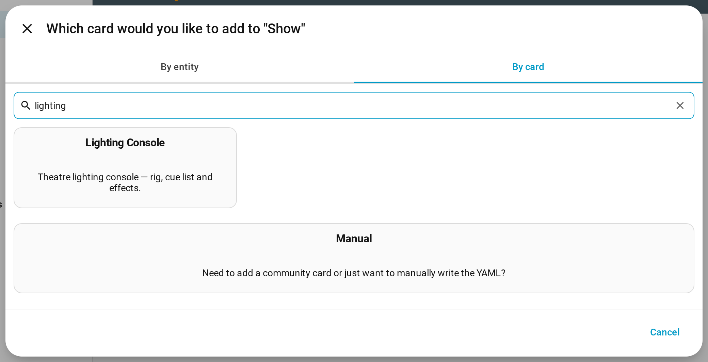
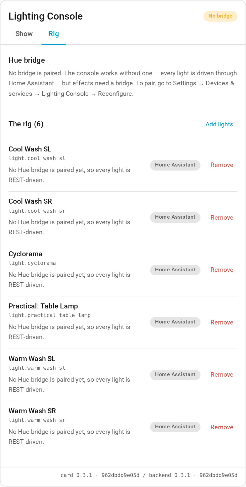
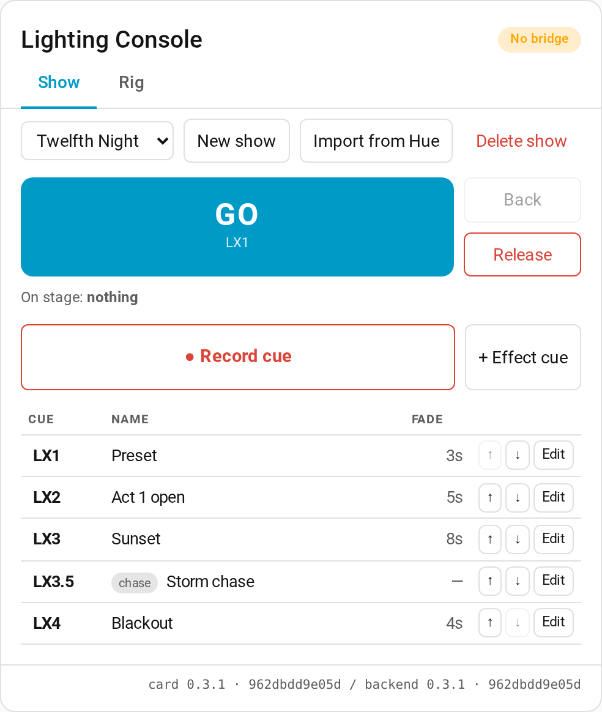
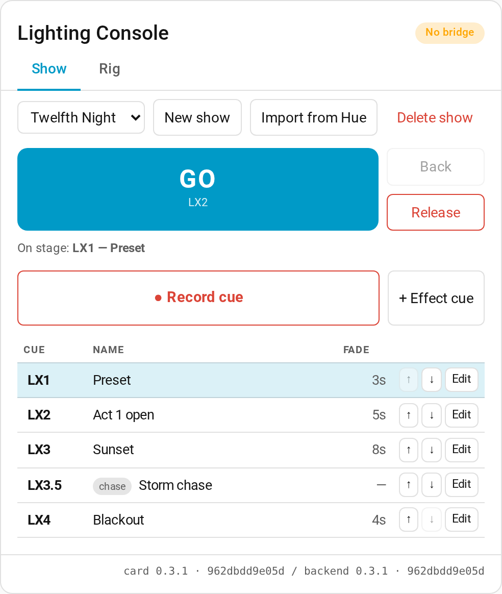
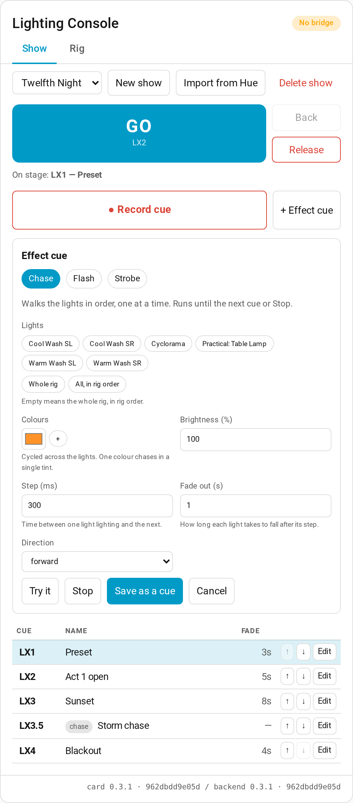

# Lighting Console

A theatre lighting console that lives inside Home Assistant.

Record a cue, edit it, drop an effect into it, press **GO**. Built for small
productions where the rig is Philips Hue bulbs, a few practicals on smart
plugs, and whatever else is to hand — and where the whole thing has to be
programmable by someone who is not a Home Assistant expert.

> **Status: pre-1.0, under active development.** The rig, shows, the cue list,
> recording, playback and effect cues all work today. Effects currently run
> over the normal Hue REST API; the Entertainment streaming layer described
> below is the next milestone, and until it lands the card says so. Nothing is
> considered 1.0 until it has run a real rehearsal on a real rig.

## Why

Home Assistant can already turn lights on. What it cannot do is run a show:
there is no cue list, no GO button, no crossfade between looks, and no way to
jump to a cue mid-rehearsal. Effects built out of `repeat` loops and
`light.turn_on` calls stagger visibly across bulbs, because the standard Hue
REST API accepts only around ten light updates a second.

This project adds the console layer:

- **A rig** — a configurable set of HA entities the console considers "the
  lights", including non-Hue bulbs, switches, dimmers and plugs.
- **Cues that capture everything.** Set the room by hand, press Record, and
  the cue restores exactly that state — including the plug you added five
  minutes ago.
- **A cue list** with GO, Back, Goto, per-cue fade times, and a current/next
  display.
- **Effects as part of a cue** — chase, strobe, pulse, colour cycle, candle
  flicker — driven over the Hue **Entertainment streaming API** at up to
  25 fps, where every light in the area updates in the same frame instead of
  stuttering one after another.
- **Graceful degradation.** If the stream cannot be established, the console
  falls back to REST, says so on the card, and the show continues.

## How it talks to Hue

Two very different APIs, used deliberately:

| | CLIP v2 REST | Entertainment streaming |
|---|---|---|
| Transport | HTTPS to the bridge | DTLS 1.2 PSK over UDP 2100 |
| Rate | ~10 light updates/sec per bridge | up to 25 fps, all lights in sync |
| Used for | discovery, pairing, entertainment areas, static looks | effects |
| Limits | rate-limited, staggers across bulbs | colour-capable Hue lights only, one area at a time per bridge |

While a stream is active the bridge ignores REST commands for the lights in
that area, so handoff between the two is explicit and driven by cue content —
never by the operator. A global **Release** always ends the stream and hands
every light back to normal Home Assistant control.

Lights that cannot be in an entertainment area — Hue white bulbs, third-party
Zigbee bulbs, switches, plugs — are first-class members of every cue and are
always driven through normal Home Assistant services.

## Installation

Requires Home Assistant **2026.8.0** or newer.

### Via HACS (recommended)

1. In HACS, add `https://github.com/sremich/ha-lighting-console-dist` as a custom
   repository with category **Integration**.
2. Install **Lighting Console**, then restart Home Assistant.
3. Go to **Settings → Devices & services → Add integration** and add
   **Lighting Console**.
4. Add the **Lighting Console** card to a dashboard.

The card is bundled inside the integration and served by it — there is no
second HACS repository to install and no Lovelace resource to register by
hand. The two always match versions, and the card shows both in its corner so
a half-finished update is visible immediately.

### Manual

Download `lighting-console.zip` from the
[latest release](https://github.com/sremich/ha-lighting-console-dist/releases),
extract it into `config/custom_components/lighting_console/`, and restart.

## Putting the card on a dashboard

Adding the integration does not put anything on your dashboard — Home
Assistant never edits your dashboards for you. Add the card once, by hand:

1. Open the dashboard you want it on.
2. Top right, the pencil (**Edit dashboard**), then **+ Add card**.
3. Switch to the **By card** tab and search for `lighting`.
4. Pick **Lighting Console**, then **Save**.



The card takes no configuration at all. If you would rather write it yourself,
the whole card is one line of YAML:

```yaml
type: custom:lighting-console-card
```

Give it a dashboard of its own if you can. The card is tall, it is the thing
you will be looking at during a show, and a dashboard called *Console* is one
tap away on a phone or a tablet at the back of the room.

**If the card ever says "Configuration error" or "Custom element doesn't
exist",** reload the page. The console is built so that this does not happen
on a restart, an update or a first install, and the release harness measures
exactly that — the one exception is updating from 0.2.0 or earlier, which
still has the window on that single upgrade boot; reload once and it is gone
for good. If it happens anywhere else, and reloading fixes it, please report
it with the Home Assistant version and roughly when after a restart the page
was opened — it is a bug, not something to live with.

## Running a show

The card has two tabs. **Rig** is the setup you do once; **Show** is the thing
you use during a performance.

### 1. Build the rig

The rig is the set of lights the console treats as "the lights". Nothing else
in your house is touched, ever.

Open the **Rig** tab, press **Add lights**, and pick your fixtures. Anything
Home Assistant can turn on can be in the rig — Hue colour bulbs, Hue whites,
third-party Zigbee bulbs, a practical lamp on a smart plug.

Hue rooms and zones, and Home Assistant light groups, are never offered and
are never rig members. A group is one broadcast that lands after every lamp's
own command and repaints the whole stage in one averaged colour, so a look
recorded with a group in the rig plays back wrong. Add each lamp individually.



The order matters: it is the order a chase walks the rig in. Reorder it so it
matches the stage, left to right.

### 2. Make a show and record some cues

A show is one production and its cue list. **New show**, give it a name, and
it becomes the active show straight away.

Then, for each look you want:

1. Set the lights however you want them — the normal Home Assistant controls,
   the Hue app, a physical dimmer, anything at all.
2. Press **● Record cue**.

The console stores exactly what the rig is doing, **including the lights that
are off**. That is deliberate: a cue that only recorded the lit fixtures would
let the previous cue bleed through it.

Each cue has a number, a name and a fade time, all editable in place. Give a
cue a fade of 5 seconds and the console crossfades into it over 5 seconds;
give it 0 and it snaps.



Inserting a cue between LX3 and LX4 gives you **LX3.5** rather than
renumbering the rest of the show — the same thing a paper cue sheet does, and
for the same reason.

**Duplicate** in a cue's editor copies it — levels, effect and fade —
straight after it as "LX3 copy", for building variations of a look.

Already have your looks as Hue scenes? **Import from Hue** turns any Hue room
or zone into a show, one cue per scene, in proper cue-number order. The scenes
are copied into real cues, so you can edit them here and tidy up the Hue app
afterwards without losing anything.

### 3. Run it

**GO** fires the next cue. The button always tells you which cue that is, and
the cue currently on stage is highlighted in the list.



- **GO** — fire the next cue, with its fade.
- **Back** — return to the previous cue.
- **Goto** — jump to any cue in the list, for rehearsing a scene out of order.
- **Release** — stop everything and take the rig to black.

**Release** is the panic button, and it is meant to be used like one. It stops
any running effect first, then blacks out, and it hands every light back to
normal Home Assistant control.

### 4. Effect cues

**+ Effect cue** adds a cue that moves: a chase, a flash, or a strobe.



Pick the effect, choose which lights it drives, set its parameters, and press
**Try it** to watch it on the rig before you commit. When it looks right,
**Save as a cue** stores exactly those parameters as a numbered cue in the
list, and it fires from GO like any other.

The lights you pick, *in the order you pick them*, are the order a chase walks
— so a chase can sweep down one side of the stage and back up the other. Leave
it empty and it uses the whole rig, in rig order.

Colours are per light — give a chase, flash or strobe one colour per lamp and
each lamp takes its own, cycling if there are fewer colours than lamps. One
colour lights everything in that colour. **★ save** next to a colour keeps it
on the show as a swatch, and a swatch fills the last colour slot so "+" then a
swatch builds a colour list without re-picking. Chase has a fade-in as well as
a fade-out.

An effect runs until the next cue or until **Stop**. Firing any cue stops a
running effect first, so a blackout is really a blackout.

### Further reading

The [wiki](https://github.com/sremich/ha-lighting-console-dist/wiki) carries
the longer versions of all of this:

- [Installation](https://github.com/sremich/ha-lighting-console-dist/wiki/Installation)
  — including the one restart that catches people out
- [Adding the card](https://github.com/sremich/ha-lighting-console-dist/wiki/Adding-the-Card)
  — putting the console on a dashboard
- [Using the console](https://github.com/sremich/ha-lighting-console-dist/wiki/Using-the-Console)
  — the rig, shows, cues, playback and effects, at length
- [Troubleshooting](https://github.com/sremich/ha-lighting-console-dist/wiki/Troubleshooting)
  — when something does not behave

## About this repository

This is the **distribution repository** for Lighting Console. It exists so that
HACS can install the integration, and it carries only the built integration,
its bundled card, and the licence.

Development happens elsewhere; issues and questions belong here. Every release
is built, stamped and verified by CI and published as `lighting-console.zip` —
nothing is assembled by hand.

## Credits

Protocol groundwork for the DTLS streaming layer was informed by
[`niklasR/ha-hue-entertainment-sequencer`](https://github.com/niklasR/ha-hue-entertainment-sequencer)
(MIT), which demonstrates Hue Entertainment streaming from Home Assistant.
This project implements its own streaming layer; see the credits in the
source where its approach is reused.

## Non-goals

No DMX, Art-Net or sACN output. No standalone web or mobile app outside Home
Assistant. No audio-reactive effects, no timecode sync. This is a show tool
that happens to live in Home Assistant — not a replacement for HA's scene
editor for general home use.
